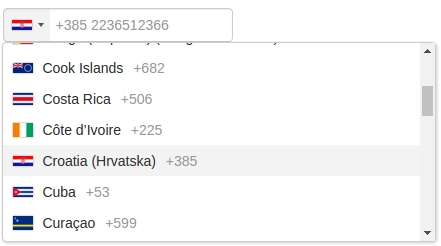

# International Telephone Input for Angular (NgxIntlTelInput)

[](#contributors)

[](https://travis-ci.org/webcat12345/ngx-intl-tel-input) [](https://badge.fury.io/js/ngx-intl-tel-input) [](https://www.npmjs.com/package/ngx-intl-tel-input)

An Angular package for entering and validating international telephone numbers. It adds a flag dropdown to any input, detects the user's country, displays a relevant placeholder and provides formatting/validation methods.



**Compatibility:**

Validation with [google-libphonenumber](https://github.com/ruimarinho/google-libphonenumber)

| ngx-intl-tel-input | Angular        | ngx-bootstrap |
| ------------------ |----------------| ------------- |
| 4.x.x              | 15.x.x - 18.x.x | >= 10.0.0      |
| 3.x.x              | 9.x.x - 14.x.x | >= 6.0.0      |
| 2.x.x              | 8.x.x - 9.1.x  | 5.6.x         |

## Installation

### Install Dependencies

`$ npm install intl-tel-input@23.8.0 --save`

`$ npm install google-libphonenumber --save`

`$ ng add ngx-bootstrap`

If you do not wish to use Bootstrap's global CSS, we now package the project with only the relevant
bootstrap styling needed for the dropdown. As such, you can remove the bootstrap styling from `angular.json`.

Further, Angular CLI should tree-shake the rest of Ngx-Boostrap away if you don't utilize other dependencies from
the bootstrap package. This should keep this dependency a lean feature-add

### Add Dependency Style

Add _'intl-tel-input'_ style file:

`./node_modules/intl-tel-input/build/css/intlTelInput.css`

to **angular.json** styles array:

```json

"styles": [
  "./node_modules/intl-tel-input/build/css/intlTelInput.css",
  "src/styles.css"
],

```

### Install This Library

`$ npm install ngx-intl-tel-input --save`

## Usage

### Import

Add `NgxIntlTelInputModule` to your module file:

```javascript
imports: [NgxIntlTelInputModule];
```

## Example

Refer to main app in this repository for working example.

Or this:

[Stackblitz Demo (Angular 8)](https://stackblitz.com/edit/ngx-intl-tel-input-demo-ng-8)

[Stackblitz Demo (Angular 9)](https://stackblitz.com/edit/ngx-intl-tel-input-demo-ng-9)

[Stackblitz Demo (Angular 10)](https://stackblitz.com/edit/ngx-intl-tel-input-demo-ng-10)

[Stackblitz Demo (Angular 11)](https://stackblitz.com/edit/ngx-intl-tel-input-demo-ng-11)

[Stackblitz Demo (Angular 12)](https://stackblitz.com/edit/ngx-intl-tel-input-demo-ng-12)

```html
<form #f="ngForm" [formGroup]="phoneForm">
	<ngx-intl-tel-input
		[cssClass]="'custom'"
		[preferredCountries]="[CountryISO.UnitedStates, CountryISO.UnitedKingdom]"
		[enableAutoCountrySelect]="false"
		[enablePlaceholder]="true"
		[searchCountryFlag]="true"
		[searchCountryField]="[SearchCountryField.Iso2, SearchCountryField.Name]"
		[selectFirstCountry]="false"
		[selectedCountryISO]="CountryISO.India"
		[maxLength]="15"
		[phoneValidation]="true"
		[inputId]="my-input-id"
		name="phone"
		formControlName="phone"
	></ngx-intl-tel-input>
</form>
```

## Options

| Options                  | Type                     | Default                           | Description                                                                                                   |
| ------------------------ | ------------------------ | --------------------------------- | ------------------------------------------------------------------------------------------------------------- |
| cssClass                 | `string`                 | `control-form`                    | Bootstrap input css class or your own custom one.                                                             |
| preferredCountries       | `<CountryISO>[]`         | `[]`                              | List of countries, which will appear at the top.                                                              |
| onlyCountries            | `<CountryISO>[]`         | `[]`                              | List of manually selected countries, which will appear in the dropdown.                                       |
| enableAutoCountrySelect  | `boolean`                | `true`                            | Toggle automatic country (flag) selection based on user input.                                                |
| enablePlaceholder        | `boolean`                | `true`                            | Input placeholder text, which adapts to the country selected.                                                 |
| customPlaceholder        | `string`                 | `None`                            | Custom string to be inserted as a placeholder.                                                                |
| numberFormat             | `<PhoneNumberFormat>`    | `PhoneNumberFormat.International` | Custom string to be inserted as a placeholder.                                                                |
| searchCountryFlag        | `boolean`                | `false`                           | Enables input search box for countries in the flag dropdown.                                                  |
| searchCountryField       | `<SearchCountryField>[]` | `[SearchCountryField.All]`        | Customize which fields to search in, if `searchCountryFlag` is enabled. Use `SearchCountryField` helper enum. |
| searchCountryPlaceholder | `string`                 | `'Search Country'`                | Placeholder value for `searchCountryField`                                                                    |
| maxLength                | `number`                 | `None`                            | Add character limit.                                                                                          |
| selectFirstCountry       | `boolean`                | `true`                            | Selects first country from `preferredCountries` if is set. If not then uses main list.                        |
| phoneValidation          | `boolean`                | `true`                            | Disable phone validation.                                                                                     |
| inputId                  | `string`                 | `phone`                           | Unique ID for `<input>` element.                                                                              |
| selectedCountryISO       | `<CountryISO>`           | `None`                            | Set specific country on load.                                                                                 |
| separateDialCode         | `boolean`                | `false`                           | Visually separate dialcode into the drop down element.                                                        |
| countryChange            | `<Country>`              | `None`                            | Emits country value when the user selects a country from the dropdown.                                        |

## Supported Formats

Following formats are supported

- NATIONAL // Produces "044 668 18 00"
- INTERNATIONAL // Produces "+41 44 668 18 00"
- E164 // Produces "+41446681800"

## Library Contributions

- Fork repo.
- Update `./projects/ngx-intl-tel-input`
- Build / test library.
- Update `./src/app` with new functionality.
- Update README.md
- Pull request.

### Helpful commands

- Build lib: `$ npm run build_lib`
- Copy license and readme files: `$ npm run copy-files`
- Create package: `$ npm run npm_pack`
- Build lib and create package: `$ npm run package`

### Use locally

After building and creating package, you can use it locally too.

In your project run:

`$ npm install --save {{path to your local '*.tgz' package file}}`

## Contributors

Thanks goes to these wonderful people ([emoji key](https://github.com/all-contributors/all-contributors#emoji-key)):

<!-- ALL-CONTRIBUTORS-LIST:START - Do not remove or modify this section -->
<!-- prettier-ignore-start -->
<!-- markdownlint-disable -->
<table>
  <tr>
    <td align="center"><a href="https://github.com/webcat12345"><br /><sub><b>webcat_black</b></sub></a><br /><a href="#design-webcat12345" title="Design">🎨</a> <a href="https://github.com/webcat12345/ngx-intl-tel-input/commits?author=webcat12345" title="Code">💻</a> <a href="https://github.com/webcat12345/ngx-intl-tel-input/commits?author=webcat12345" title="Documentation">📖</a> <a href="#ideas-webcat12345" title="Ideas, Planning, & Feedback">🤔</a> <a href="#question-webcat12345" title="Answering Questions">💬</a> <a href="#infra-webcat12345" title="Infrastructure (Hosting, Build-Tools, etc)">🚇</a> <a href="#example-webcat12345" title="Examples">💡</a> <a href="#maintenance-webcat12345" title="Maintenance">🚧</a> <a href="https://github.com/webcat12345/ngx-intl-tel-input/pulls?q=is%3Apr+reviewed-by%3Awebcat12345" title="Reviewed Pull Requests">👀</a> <a href="https://github.com/webcat12345/ngx-intl-tel-input/commits?author=webcat12345" title="Tests">⚠️</a></td>
    <td align="center"><a href="http://pasevin.com"><br /><sub><b>Aleksandr Pasevin</b></sub></a><br /><a href="https://github.com/webcat12345/ngx-intl-tel-input/commits?author=pasevin" title="Code">💻</a> <a href="https://github.com/webcat12345/ngx-intl-tel-input/commits?author=pasevin" title="Documentation">📖</a> <a href="https://github.com/webcat12345/ngx-intl-tel-input/issues?q=author%3Apasevin" title="Bug reports">🐛</a> <a href="#platform-pasevin" title="Packaging/porting to new platform">📦</a> <a href="#plugin-pasevin" title="Plugin/utility libraries">🔌</a> <a href="#question-pasevin" title="Answering Questions">💬</a> <a href="#infra-pasevin" title="Infrastructure (Hosting, Build-Tools, etc)">🚇</a> <a href="#example-pasevin" title="Examples">💡</a> <a href="#maintenance-pasevin" title="Maintenance">🚧</a> <a href="https://github.com/webcat12345/ngx-intl-tel-input/pulls?q=is%3Apr+reviewed-by%3Apasevin" title="Reviewed Pull Requests">👀</a> <a href="https://github.com/webcat12345/ngx-intl-tel-input/commits?author=pasevin" title="Tests">⚠️</a></td>
    <td align="center"><a href="https://github.com/Dviejopomata"><br /><sub><b>Dviejo</b></sub></a><br /><a href="https://github.com/webcat12345/ngx-intl-tel-input/commits?author=Dviejopomata" title="Code">💻</a> <a href="https://github.com/webcat12345/ngx-intl-tel-input/issues?q=author%3ADviejopomata" title="Bug reports">🐛</a> <a href="#example-Dviejopomata" title="Examples">💡</a> <a href="https://github.com/webcat12345/ngx-intl-tel-input/commits?author=Dviejopomata" title="Tests">⚠️</a> <a href="#question-Dviejopomata" title="Answering Questions">💬</a> <a href="#maintenance-Dviejopomata" title="Maintenance">🚧</a> <a href="https://github.com/webcat12345/ngx-intl-tel-input/pulls?q=is%3Apr+reviewed-by%3ADviejopomata" title="Reviewed Pull Requests">👀</a></td>
    <td align="center"><a href="https://www.fosforito.net"><br /><sub><b>Jens Wagner</b></sub></a><br /><a href="https://github.com/webcat12345/ngx-intl-tel-input/commits?author=Fosforito" title="Code">💻</a></td>
    <td align="center"><a href="http://kino.codes"><br /><sub><b>Kino Roy</b></sub></a><br /><a href="https://github.com/webcat12345/ngx-intl-tel-input/commits?author=kinoroy" title="Code">💻</a></td>
    <td align="center"><a href="https://twitter.com/wwwalkerrun"><br /><sub><b>Nathan Walker</b></sub></a><br /><a href="#maintenance-NathanWalker" title="Maintenance">🚧</a> <a href="https://github.com/webcat12345/ngx-intl-tel-input/commits?author=NathanWalker" title="Code">💻</a></td>
    <td align="center"><a href="https://github.com/jiarongxu"><br /><sub><b>Jiarong Xu</b></sub></a><br /><a href="https://github.com/webcat12345/ngx-intl-tel-input/commits?author=jiarongxu" title="Code">💻</a></td>
  </tr>
  <tr>
    <td align="center"><a href="https://crutchcorn.dev"><br /><sub><b>Corbin Crutchley</b></sub></a><br /><a href="https://github.com/webcat12345/ngx-intl-tel-input/commits?author=crutchcorn" title="Code">💻</a></td>
    <td align="center"><a href="https://www.linkedin.com/in/nayeli-beckham-martínez/"><br /><sub><b>Nayeli Beckham</b></sub></a><br /><a href="https://github.com/webcat12345/ngx-intl-tel-input/commits?author=NayeBeckham" title="Code">💻</a> <a href="#platform-NayeBeckham" title="Packaging/porting to new platform">📦</a> <a href="#question-NayeBeckham" title="Answering Questions">💬</a> <a href="#maintenance-NayeBeckham" title="Maintenance">🚧</a></td>
    <td align="center"><a href="http://rushvora.com"><br /><sub><b>Rushabh Vora</b></sub></a><br /><a href="https://github.com/webcat12345/ngx-intl-tel-input/commits?author=rushvora" title="Code">💻</a></td>
    <td align="center"><a href="https://github.com/KarimTayie"><br /><sub><b>Karim Tayie</b></sub></a><br /><a href="https://github.com/webcat12345/ngx-intl-tel-input/commits?author=KarimTayie" title="Code">💻</a></td>
    <td align="center"><a href="https://github.com/imadilkhalil"><br /><sub><b>Adil Khalil</b></sub></a><br /><a href="https://github.com/webcat12345/ngx-intl-tel-input/commits?author=imadilkhalil" title="Code">💻</a></td>
    <td align="center"><a href="https://github.com/ambersz"><br /><sub><b>Alice Zhao</b></sub></a><br /><a href="https://github.com/webcat12345/ngx-intl-tel-input/commits?author=ambersz" title="Code">💻</a></td>
    <td align="center"><a href="https://www.felipecespedes.co"><br /><sub><b>Felipe Céspedes</b></sub></a><br /><a href="https://github.com/webcat12345/ngx-intl-tel-input/commits?author=felipecespedes" title="Code">💻</a></td>
  </tr>
  <tr>
    <td align="center"><a href="https://github.com/bb-sonam"><br /><sub><b>bb-sonam</b></sub></a><br /><a href="https://github.com/webcat12345/ngx-intl-tel-input/commits?author=bb-sonam" title="Code">💻</a></td>
    <td align="center"><a href="https://github.com/alQlagin"><br /><sub><b>Alex Kulagin</b></sub></a><br /><a href="https://github.com/webcat12345/ngx-intl-tel-input/commits?author=alQlagin" title="Code">💻</a></td>
    <td align="center"><a href="https://github.com/subodhyadav712"><br /><sub><b>Subodh Kumar Yadav</b></sub></a><br /><a href="https://github.com/webcat12345/ngx-intl-tel-input/commits?author=subodhyadav712" title="Code">💻</a></td>
    <td align="center"><a href="https://github.com/harshalganbote"><br /><sub><b>harshalganbote</b></sub></a><br /><a href="https://github.com/webcat12345/ngx-intl-tel-input/commits?author=harshalganbote" title="Code">💻</a></td>
    <td align="center"><a href="https://github.com/christianopaets"><br /><sub><b>christianopaets</b></sub></a><br /><a href="https://github.com/webcat12345/ngx-intl-tel-input/commits?author=christianopaets" title="Code">💻</a></td>
    <td align="center"><a href="https://github.com/velechva"><br /><sub><b>Victor Velechovsky</b></sub></a><br /><a href="https://github.com/webcat12345/ngx-intl-tel-input/commits?author=velechva" title="Code">💻</a></td>
    <td align="center"><a href="https://www.mapianist.com"><br /><sub><b>Heo</b></sub></a><br /><a href="https://github.com/webcat12345/ngx-intl-tel-input/commits?author=leo6104" title="Code">💻</a></td>
  </tr>
  <tr>
    <td align="center"><a href="https://wagner.pink"><br /><sub><b>jlw</b></sub></a><br /><a href="https://github.com/webcat12345/ngx-intl-tel-input/commits?author=jenslw" title="Code">💻</a></td>
  </tr>
</table>

<!-- markdownlint-restore -->
<!-- prettier-ignore-end -->

<!-- ALL-CONTRIBUTORS-LIST:END -->

This project follows the [all-contributors](https://github.com/all-contributors/all-contributors) specification. Contributions of any kind welcome!
